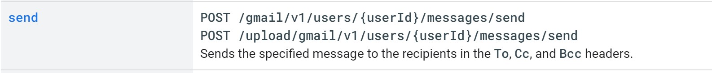

# Email Transfer and Security
## Simple Mail Transfer Protocol (SMTP)
The Simple Mail Transfer Protocol is a method for sending and receiving emails across an internet connection. Read the [standard](https://tools.ietf.org/html/rfc821.html). Here is an ASCII diagram of the protocol:

```
            +----------+                +----------+
+------+    |          |                |          |
| User |<-->|          |      SMTP      |          |
+------+    |  Sender- |Commands/Replies| Receiver-|
+------+    |   SMTP   |<-------------->|    SMTP  |    +------+
| File |<-->|          |    and Mail    |          |<-->| File |
|System|    |          |                |          |    |System|
+------+    +----------+                +----------+    +------+


            Sender-SMTP                Receiver-SMTP
```

The user or file system sends input to the sender-SMTP, which communicates with the Receiver-SMTP and may or may not be allowed to send the email. The Sender and Receiver communicate with commands like EMAIL, OK, RCPT. Once the Receiver-SMTP gives the OK to send the email, the Sender sends the mail data, terminating with a special sequence.

Google's [SMTP](https://developers.google.com/gmail/imap/imap-smtp) server is at `smtp.google.com` port `465`.

In Python, the built-in module for dealing with SMTP is `smtplib`, which has `smtplib.SMTP` and `smtplib.SMTP_SSL`, objects that encapsulate an SMTP instance.

## Secure Sockets Layer (SSL)
SSL has a successor, TLS (Transport Layer Security). Both are "protocols for establishing authenticated and encrypted links between networked computers," ([source](https://www.ssl.com/faqs/faq-what-is-ssl/)). Simplistically, these protocols encrypt your data when it is transfered over a network.

In Python, the module for dealing with SSL is `ssl`, which contains `ssl.create_default_context()` to "load the system’s trusted CA certificates, enable host name checking and certificate validation, and try to choose reasonably secure protocol and cipher settings," ([source](https://realpython.com/python-send-email/)).

Before using `smtplib.SMTP_SSL`, you should first create an SSL context with the above function, or a customized one, and use that as the `context` argument to `SMTP_SSL`. For example:

```py
g_host = 'smtp.google.com'
g_port = 465
g_context = ssl.create_default_context()

with smtplib.SMTP_SSL(host=g_host, port=g_port, context=g_context) as g:
    g.login("dev.charlie.gallagher@gmail.com", passwd)
    g.sendmail(from_address, to_address, message)  # Diagram
```


# Formatting Emails
## Multipurpose Internet Mail Extensions (MIME)
[MIME](https://tools.ietf.org/html/rfc2045.html) is a standard for extending mail transmission to include images, sounds, and other types of multimedia.

The Python tool for handling MIME is `email`. This is a package of modules for creating, reading, decoding, and encoding emails for tranfer with SMTP. Much of it goes over my head, but there is good documentation.

### `email.message`
This module contains the class `EmailMessage`. From the `email.message` documentation:

>An email message consists of _headers_ and a _payload_ (also referred to as the _content_). Headers are RFC 5322 or RFC 6532 style field names and values, where the field name and value are separated by a colon. The colon is not part of either the field name or the field value. The payload may be a simple text message, or a binary object, or a structured sequence of sub-messages each with their own set of headers and their own payload. The latter type of payload is indicated by the message having a MIME type such as `multipart/*` or `message/rfc822`.
>
>The conceptual model provided by an `EmailMessage` object is that of an ordered dictionary of headers coupled with a _payload_ that represents the RFC 5322 body of the message, which might be a list of sub-EmailMessage objects.\[...\]
>
>The `EmailMessage` dictionary-like interface is indexed by the header names, which must be ASCII values. The values of the dictionary are strings with some extra methods. Headers are stored and returned in case-preserving form, but field names are matched case-insensitively. Unlike a real `dict`, there is an ordering to the keys, and there can be duplicate keys. Additional methods are provided for working with headers that have duplicate keys.
>
>The payload is either a `string` or `bytes` object, in the case of simple message objects, or a list of `EmailMessage` objects, for MIME container documents such as `multipart/*` and `message/rfc822` message objects.

That's a whole large chunk of documentation, but it's fairly concise all things considered.

### `email.generator`
I will be generating a flat version of the email message. From the documentation:

>One of the most common tasks is to generate the flat (serialized) version of the email message represented by a message object structure. You will need to do this if you want to send your message via smtplib.SMTP.sendmail() or the nntplib module, or print the message on the console. Taking a message object structure and producing a serialized representation is the job of the generator classes.

Probably, I will be using a `BytesGenerator` object to serialize my messages for transfer with `smtplib`.


### `email.policy`
Each email needs a policy, which includes all sorts of options for deviating from the defaults and RFCs. A potentially important default is `linesep`, which is by default `\n` (Python's own line separator). But Windows uses `\r\n` as its line separator. In general, a good policy is `email.policy.SMTP` or `email.policy.SMPTUTF8`, if UTF-8 is handled. This is a good one for me because Twitter users use lots of UTF-8 character.


### Creating a basic text and html email
```py
text = """\
Hi,
How are you?
Real Python has many great tutorials:
www.realpython.com"""
html = """\
<html>
  <body>
    <p>Hi,<br>
       How are you?<br>
       <a href="http://www.realpython.com">Real Python</a>
       has many great tutorials.
    </p>
  </body>
</html>
"""
```

Here are two items I would like to send after preparing them with `email`. How will I do this? I need to make an `email.EmailMessage` instance that contains the appropriate headers and content.

Here's an  example from the docs:

```py
# Import smtplib for the actual sending function
import smtplib

# Import the email modules we'll need
from email.message import EmailMessage

# Open the plain text file whose name is
in textfile for reading.
with open(textfile) as fp:
    # Create a text/plain message
    msg = EmailMessage()
    msg.set_content(fp.read())

# me == the sender's email address
# you == the recipient's email address
msg['Subject'] = f'The contents of {textfile}'
msg['From'] = me
msg['To'] = you

# Send the message via our own SMTP server.
s = smtplib.SMTP('localhost')
s.send_message(msg)
s.quit()
```

Quickly adapting this:

```py
import smtplib
from email.message import EmailMessage

me = "dev.charlie.gallagher@gmail.com"
text = """\
Hi,
How are you?
Real Python has many great tutorials:
www.realpython.com"""

msg = EmailMessage()
msg.set_content(text)

msg['Subject'] = "Hello to you"
msg['From'] = me
msg['To'] = me

g_host = 'smtp.gmail.com'
g_port = 465
g_context = ssl.create_default_context()
passwd = input(f"Username: {me}\nPassword: ")

with smtplib.SMTP_SSL(host=g_host, port=g_port, context=g_context) as g:
    g.login("dev.charlie.gallagher@gmail.com", passwd)
    g.send_message(msg)
```

This didn't work, and I'm not sure why. Ah, it turns out I mistyped `smtp.gmail.com` as `smtp.google.com`. Damn that's tricky. Oh well.


## GMail API
Here is the startup file used to get OAuth2.0 set up for a program.

```py
import pickle
import os.path
from googleapiclient.discovery import build
from google_auth_oauthlib.flow import InstalledAppFlow
from google.auth.transport.requests import Request

# If modifying these scopes, delete the file token.pickle.
SCOPES = ['https://www.googleapis.com/auth/gmail.readonly']

def main():
    """Shows basic usage of the Gmail API.
    Lists the user's Gmail labels.
    """
    creds = None
    # The file token.pickle stores the user's access and refresh tokens, and is
    # created automatically when the authorization flow completes for the first
    # time.
    if os.path.exists('token.pickle'):
        with open('token.pickle', 'rb') as token:
            creds = pickle.load(token)
    # If there are no (valid) credentials available, let the user log in.
    if not creds or not creds.valid:
        if creds and creds.expired and creds.refresh_token:
            creds.refresh(Request())
        else:
            flow = InstalledAppFlow.from_client_secrets_file(
                'credentials.json', SCOPES)
            creds = flow.run_local_server(port=0)
        # Save the credentials for the next run
        with open('token.pickle', 'wb') as token:
            pickle.dump(creds, token)

    service = build('gmail', 'v1', credentials=creds)

    # Call the Gmail API
    results = service.users().labels().list(userId='me').execute()
    labels = results.get('labels', [])

    if not labels:
        print('No labels found.')
    else:
        print('Labels:')
        for label in labels:
            print(label['name'])

if __name__ == '__main__':
    main()
```

In my file system I have a file 'credentials.json' (which has been added to .gitignore) which contains my sensitive API keys and credentials. This is accessed by the above program, and then a pickle is created containing my further credentials such as my refresh token.

When using this, you pass your credentials to the server with a refresh token. An application used this line:

```py
g.docmd('AUTH', 'XOAUTH2 ' + auth_string)
```

where `g` is an instance of SMTP_SSL.


# Google's Gmail API
Let's just back up now and get a handle on Google's Gmail API documentation and call it a day.

OAuth2 sends the user to Gmail to authorize their account. Then, it sends back to you a refresh token and probably some other things. Learning more about that later. For now, I will just be learning the rudiments of the API.

The base url is `https://gmail.googleapis.com`. This is a screen cap of the 'send' endpoints.




## My credentials
I was given credentials by Google in a `<google.oauth2.credentials.Credentials object at 0x015CE718>` type object, stored in a pickle file in my folder and added to .gitignore.

The attributes and methods associated with this are as follows:

```
['__abstractmethods__', '__class__', '__delattr__', '__dict__', '__dir__', '__doc__', '__eq__', '__format__', '__ge__', '__getattribute__', '__getstate__', '__gt__', '__hash__', '__init__', '__init_subclass__', '__le__', '__lt__', '__module__', '__ne__', '__new__', '__reduce__', '__reduce_ex__', '__repr__', '__setattr__', '__setstate__', '__sizeof__', '__str__', '__subclasshook__', '__weakref__', '_abc_impl', '_client_id', '_client_secret', '_id_token', '_quota_project_id', '_refresh_token', '_scopes', '_token_uri', 'apply', 'before_request', 'client_id', 'client_secret', 'expired', 'expiry', 'from_authorized_user_file', 'from_authorized_user_info', 'has_scopes', 'id_token', 'quota_project_id', 'refresh', 'refresh_token', 'requires_scopes', 'scopes', 'to_json', 'token', 'token_uri', 'valid', 'with_quota_project']
```

If `<obj>.valid` returns `False`, use the following snippet:

```py
import pickle
from google.auth.transport.requests import Request

with open('token.pickle', 'rb') as tok:
    auth = pickle.load(tok)

auth.refresh(Request())

with open('token.pickle', 'wb') as tok:
    pickle.dump(auth, tok)
```

This should make it valid again.

Okay, going through the API after all. This is done in the Gmail quickstart file above with

```py
service = build('gmail', 'v1', credentials=creds)
```

Then you can call different things you need through a convoluted API framework. The process is outlined in [this](https://developers.google.com/gmail/api/guides/sending) post. You first create a message with base64 encoded text, then pass you credentials to the API and send your email.


```py
def create_message(sender, to, subject, message_text):
  """Create a message for an email.

  Args:
    sender: Email address of the sender.
    to: Email address of the receiver.
    subject: The subject of the email message.
    message_text: The text of the email message.

  Returns:
    An object containing a base64url encoded email object.
  """
  message = MIMEText(message_text)
  message['to'] = to
  message['from'] = sender
  message['subject'] = subject
  return {'raw': base64.urlsafe_b64encode(message.as_string())}


  def send_message(service, user_id, message):
    """Send an email message.

    Args:
      service: Authorized Gmail API service instance.
      user_id: User's email address. The special value "me"
      can be used to indicate the authenticated user.
      message: Message to be sent.

    Returns:
      Sent Message.
    """
    try:
      message = (service.users().messages().send(userId=user_id, body=message)
                 .execute())
      print 'Message Id: %s' % message['id']
      return message
    except errors.HttpError, error:
      print 'An error occurred: %s' % error
```

This should be all I need. 
